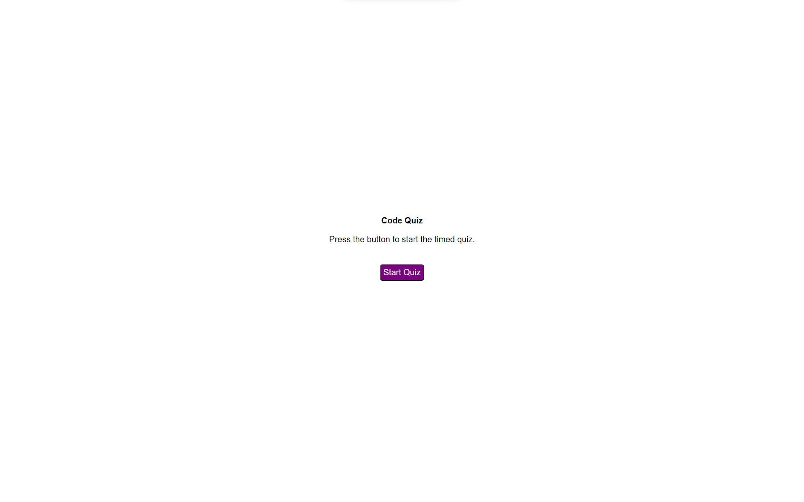

# Code Quiz

Visit the [Code Quiz](https://kdelaria.github.io/code-quiz/) webpage.

## Description

 This webpage was designed to quiz the user on their knowledge of Javascript.

## Installation

N/A

## Usage

Click on the "Start Quiz" button to start the quiz. Select the correct answers to add to your score. Save your score by clicking the "Save" button, and filling out your name in the input box.  Then click "Save" again to add your score to the list of scores.  To view the list of scores click the "View Scores" button.  To go back to the page to start a new quiz click the "Back" button.

## Credits

*"JavaScript Type Conversion" W3Schools, *[w3schools.com/js/js_arrays.asp](https://www.w3schools.com/js/js_arrays.asp)*. Accessed 23 Dec. 2023.*

*"JavaScript Array Sort" W3Schools, *[w3schools.com/js/js_array_sort.asp](https://www.w3schools.com/js/js_array_sort.asp)*. Accessed 24 Dec. 2023.*

*"Fisher Yates Method""JavaScript Tryit Editor" W3Schools, *[w3schools.com/js/tryit.asp?filename=tryjs_array_sort_random2](https://www.w3schools.com/js/tryit.asp?filename=tryjs_array_sort_random2)*. Accessed 24 Dec. 2023.*
Accessed 13 Dec, 2023.*

*"JavaScript String Methods" W3Schools, *[w3schools.com/js/js_string_methods.asp](https://www.w3schools.com/js/js_string_methods.asp)*. Accessed 30 Dec. 2023.*

*"JavaScript DOM CSS" W3Schools, *[w3schools.com/js/js_htmldom_css.asp](https://www.w3schools.com/js/js_htmldom_css.asp)*. Accessed 30 Dec. 2023.*

## License
N/A